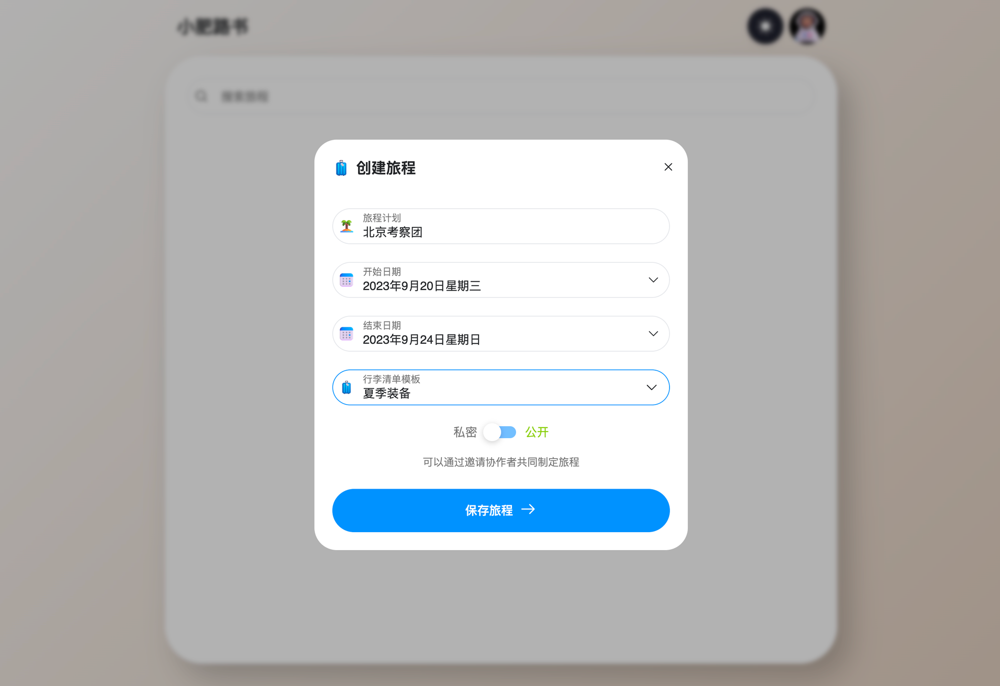
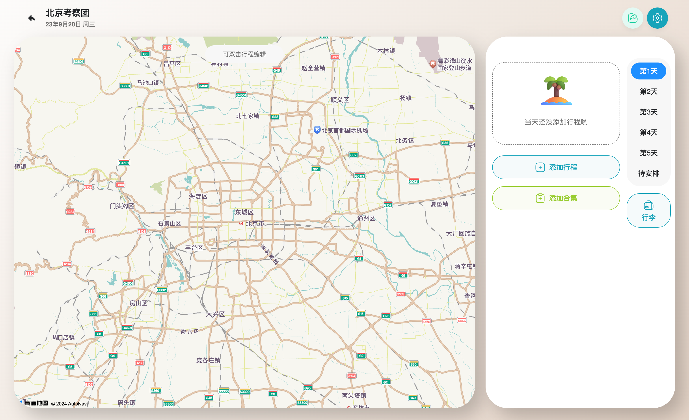
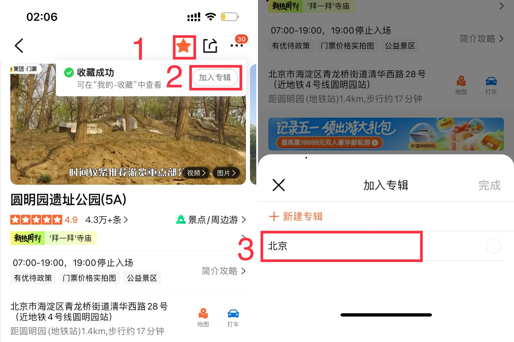
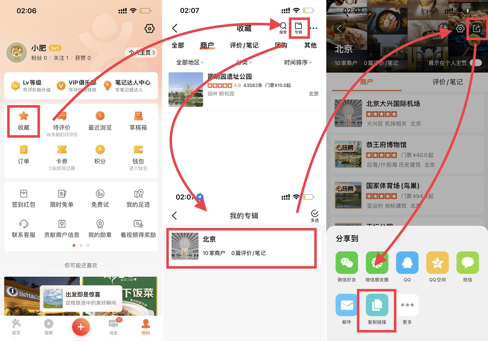

# 🗺️ 旅程计划

点击 创建旅程 按钮，填写旅程计划名称与旅程时间

::: tip

行李清单模板默认提供两个行李清单模板，自建服务可自行更新清单模板

:::

旅程可选 **私密** 或 **公开**，公开即所有人可通过分享的链接直接查看旅程，私密则需要通过邀请链接加入旅程计划参与者后编辑或查看。

## 添加行程

旅程的第一步都是先要收集目标城市的所有想去的，并将想去的目的地加入到我们的计划中

### ⛱️ 添加点评合集（推荐）

1. 收集目的地、加入专辑
    
    在点评APP中搜索旅行目标城市的景点、美食，通过自己的数据分析，找到自己想去的地方，收藏并加入到专辑
    
2. 复制专辑链接
    
    将所有的目的地加入到专辑后，我们就可以进入到个人中心
    
    点击收藏 → 右上角点击专辑按钮
    
    进入对应旅程的专辑后
    
    点击右上角分享按钮→选择复制链接
    
3. 点击 **添加合集** 按钮，将链接粘贴进输入框，点击 **添加点评合集** 按钮 

### 🫰手动添加行程

1. 点击 **添加行程按钮** ，打开添加行程弹窗
2. 点击 **选择坐标** 通过高德地图搜索行程目的地，点击 确认选择 即可得到地点的名称与坐标等。

## 编辑行程

添加的行程未设置出发时间都将会在待安排列表中等待安排

我们可以通过点击列表中行程右上角的 **更多图标** 按钮，亦可以 **双击地图中的图钉** 打开编辑行程弹窗

可以在编辑的行程的类型，行程的类型分为 **行程与住宿**

住宿类型需要填写 **住店时间 与 离店时间**

并选择准备前往的交通方式，飞机高铁等公共交通系统，亦可以上传自己的票据，二维码。

## 享受旅程

在手机端，可以将路书页面分享至桌面

- 点击行程的前往可以快速切换至高德地图的导航
- 点击橙色的按钮亦可以快速跳转到点评的行程详情页面。
- 点击行程的 截图/票据 中的图片，可以快速打开票据的图片
- 点击查看攻略，也可以将你收藏的攻略快速打开查看

